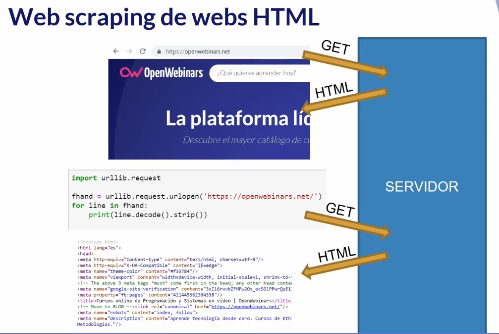

# Introduccion
Socket (enchufe): comunicacion bidireccional entre
dos app. objetivo es la comunicacion entre cliente-servidor.

Cuando se establece una comuniacion el cliente
y el servidor hacen una negociacion para
ver como comunicarse.

HTTP (Hypertext Tranfer Protocol): protocolo
el cual permite transf de info cliente-servidor
que utilizan paginas web.

Protocolo: unas reglas precisas que permiten
que dos o mas entidades se comuniquen entre
ellas para transmitir info.

## Navegador web

### `NavegadorWeb`
Previamente
```bash
$ pwd
/home/ubuntu/DAM2/SXE/docker/trabajando_con_volumenes
$ docker run -tdi -p 8080:80 -v 
"$PWD"/htdocs:/usr/local/apache2/htdocs/ 
--name dam_httpd httpd
```

### Conclusiones
Esto basicamente es lo que hace un navegador normal.
1. Navegador envia un comando `GET` utilizando
el protocolo HTTP
2. Recibe el HTML y lo transforma para que
quede de una forma visual agradable



## Analisis de HTML mediante Beautifulsoup
Libreria en Python que permite analizar
documentos HTML y extraer datos de ellos,
compenando imperfecciones que puedan existir.

Ej: permite extraer de los atributos `href`
de las etiquetas `a`

```html
<a href = "http://www.ncbi.nim.nih.gov/" target="_blanck">the NCBI web site</a>
```

>Basicamente esta libreria nos permite
extraer datos de los docus HTML sin tener que
saber mucho de HTML

1. `ParseandoHTMLConBeautifulSoup`
2. `WebCrawler`

## Web Scraping con Selenium
Libreria que permite automatizar
navegadores web. Existen paginas webs
que no utilizan unicamente HTML e incluso
pueden utilizar urls que no varian, que son
estáticas.

[Hay que instalar un driver para chrome/firefox](https://chromedriver.chromium.org/downloads)
[Docu oficial Selenium](https://selenium-python.readthedocs.io/)

Ejemplo dd es util. Por ejemplo pag
web dd hay datos que me interesa extraer
pero tienes que acceder a un formulario
para acceder a cada uno de aquellos
datos que me interesa extraer.

Paginas web:
https://eportal.mapa.gob.es/websiar/SeleccionParametrosMap.aspx?dst=1


## Bibliografia

[open webinars](https://openwebinars.net/academia/aprende/web-scraping/5584/)