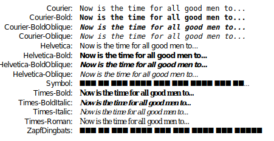

# Haciendo modificaciones visuales - Tuning

## Colors

### Overlaping

2 posibles formas

1. `overPrinting`
* solo puede ser usuado por `CMYK`
* permite mezclar colores obteniendo uno nuevo

2. seting `ALPHA` value (transparencia)
* solo para `RGB`
* `alpha`==opacity value, where default: 1 (fully opaque)

### CMYK Colors

De momento esta parte la voy a pasar.

### Color space checking

`enforceColorSpace` dependiento del valor que escogas
(RGB, CMYK...) se establecera la regla de usar solo
ese modelo para pintar color. Si escoger RGB Y pintas con 
CMYK = EXCEPCION

### Color Overprinting

`overPrint` para mezclar colores. Algunso pdfs readers
no lo soportan.

## Fonts & Text Objects

