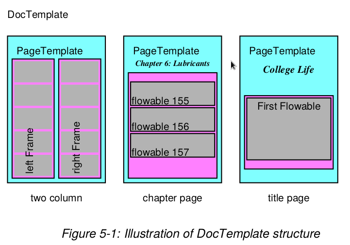

# Platypus

* significa Page Layout and Typography Using Scripts.
* libreria de diseño de pagina de alto nivel.
* busca separar el diseño de alto nivel del contenido.

**Diseño por capas:**
1. `DocTemplates` contenedor más externo.
2. `PageTemplates` especificaciones para diseños
de páginas de varios tipos.
3. `Frames` especificaciones para regiones en páginas
que contienen txt y gráficos fluídos.
4. `Flowables` txt y gráficos que pueden **fluir** en el doc
como imágenes, `Paragraph`, `Table` pero NO cosas como 
pies de páginas, o gráficos de páginas **fijos**.
5. `pdfgen.Canvas` el nivel más bajo, que finalmente
recibe la pintura del docu de las otras capas.



**Como Crear Platypus**

1. Se crear un documento a partir de la clase `DocTemplate`
2. Se pasa lista de `Flowables` a su método `build`
3. El método `build` procesa la lista de elementos `Flowables`.

## :one: Tipo capa: `DocTemplate` 

La clase `DocTemplate` internamente contiene
varios eventos que implementan layouts y formateos.

Cada uno de esos eventos tiene su correspondiente
método manejador llamado `handle_XXX` dd `XXX` es el 
nombre del evento.

_Ejemplo:_ Evento tipico `frameBegin` el cual 
ocurre cd se empieza a usar un frame por primera vez.

## :two: Tipo capa: `Flowables`

### Metodos de `Flowables` :hammer_and_wrench:

Los `Flowables` son cosas que pueden ser dibujadas y las cuales 
pueden tener metodos `wrap`, `draw` y quizás `split` (mas
info `B_flowables`) 

1. `Flowable.draw`
* Para pedir que el `Flowable` se represente asi mismo.
* realmente este metodo (`draw`) no existe ya que 
el codigo debe garantizar que el `Flowable` tiene un 
lienzo sobre el que pintarse (`canv`). Por eso
el que si existe es `drawOn` ya que se tiene que especificar
el `canv`.

```python
Flowable.drawOn(canvas,x,y)
```

2. `Flowable.draw`
* Se llama antes de que se dibuje.
* Para informas al `Flowable` sobre las dimensiones disponibles
en el marco para que pueda ajustar su tamaño en consecuencia.

```python
Flowable.wrap(availWidth, availHeight)
```

3. `Flowable.split`

* intenda dividir un `Flowable` despues de que el 
metodo `wrap` ha fallado.
* objetivo: conseguir que el `Flowable` se divida 
en partes mas pequeñas si este no cabe en el espacio
disponible.
* frames + sofisticados
* si el espacio=suficiente devuelve `[self]` si
no lo es:
  * En flowables estupidos, `Flowables` 
  simples, que NO pueden dividirse, el metodo `split` 
  devuelve una lista vacía (`[]`), lo que significa
  que ellos no estan habilitados para splitear.
  * En flowables inteligentes, que se pueden 
  dividir, se splitean a si mismos
  y devuelven una lista de nuevos flowables `[f0,...]`

```python
Flowable.split(self, availWidth, availheight)
```
> De momento no tengo ningun ejemplo de esto en codigo!!!!
> pq creo que no ENTRA!!!

4. `Flowable.getSpace`
* proporcionan orientacion sobre el espaciado vertical de
antes y despues de un flowable y su alineación
horizontal en el contexto del marco en el que se está
colocando.
* Por defecto devuelven cero.
* Devuelven ct espacio deberia seguir/preceder al flowable.

```python
Flowable.getSpaceAfter(self)
Flowable.getSpaceBefore(self)
```

----

Todos los flowables tinenen una propiedad llamada
`hAlign` que puede tener valores como `LEFT`, `RIGHT`,
`CENTER`, o `CENTRE`. Para párrafos que llenan el ancho
completo del marco esto no tiene ningun efecto. Sin embargo,
para tablas, imagenes, u otros objetos que son más 
pequeños que el ancho del marco, esto **determina
su colocación horizontal**.

---

La clase `Flowable` es una clase abstacta para cosas
que pueden ser dibujadas. Cada instancia de la misma
conoce su tamaño, tiene su propio sistema de coords (pero 
esto requiere que la API base proporcione un sist de coords
absolutas cd se llama al metodo `Flowable.draw`).

> Es importante destacar que
> la clase `Flowable` es una clase abstracta y normalmente
> usada SOLO como una **clase base**.

### Platypus Story

Consiste en una secuencia de elementos
basicos `Flowables` y esos elementos conducen los datos
conducidos por el motor de formateo de Platypus.

Para modificar el comportamiento del motor
existe un tipo espcecial de `Flowable` llamado
`ActionFlowables` le dice al diseño del motor que, por ejemplo,
salte a la siguiente columna o se cambie a otro
`PageTemplate`.


## :three: Tipo capa: `Frame`

Contenedores activos, areas especifica dd se puede
colocar contenido, que a su vez están contenidos
en `PageTemplates`.

```python
Frame(x1, y1, width, height, leftPadding=6, bottomPadding=6,
            rightPadding=6, topPadding=6, id=None, showBoundary=0)
```

* `leftPadding, bottomPadding...` rellenos 
que reducen el espacio disponible para 
el dibujo dentro del marco (cantidades positivas).
* `id` identificador opcional.
* `showBoundary` si !=0, se dibuja borde del marco (para visualizarlo).

### Metodos de `Frame` :hammer_and_wrench:

* `Frame.addFromList(drawlist, canvas)` pone objetos de la
`drawlist` hasta que el frame esta completo. Si pasa lo ultimo = excepcion.
  * este metodo maneja las llamadas a `wrap` y `drawOn` por ti.
* `Frame.split(flowable, canvas)` le pide al `flowable`
que se divida que se divida usando el espacio disponible 
y devuelve la lista de flowables.
* `Frame.drawBoundary(canvas)` dibuja el limico del frame.


## :four: Tipo capa: Documents and Templates (`PageTemplates`)

`BaseDocTemplate` 
* Clase con maquinaria necesaria para el formateo del doc. 
* Cada instancia contiene lista de 1 o + `PageTemplates` que pueden
ser usados para describir el layout de la info de una pag.
* Metodo `build` para procesar una lista de flowables para producir
un pdf.

```python
BaseDocTemplate(self, filename,
                pagesize=defaultPageSize,
                pageTemplates=[],
                showBoundary=0,
                leftMargin=inch,
                rightMargin=inch,
                topMargin=inch,
                bottomMargin=inch,
                allowSplitting=1,
                title=None,
                author=None,
                _pageBreakQuick=1,
                encrypt=None)
```

* `filename` nombre del archivo que va a recibir el pdf.
* `allowSplitting` determina si lo metodos incorporados
deben intentar dividir los flowables individuales en los
frames.
* `_pageBreakQuick` si es 1 se intenta finalizar todos
los marcos en la pag actual antes de finalizar la siguiente.
Util para asegurarme de que los ele de la pag actual
esten completos antes de pasar a la siguiente.
* `encrypt` si el docu debe ser encriptado. Si se la pasa
una String, esa va a ser la contraseña del doc pero si es una
intrancia de ... se usa para encriptar el pdf.

> `PageTemplates` son instancias que describen el 
> diseño de una pag y contienen info sobre la dispo
> de lo marcos y otros ele.

### Metodos de `BaseDocTemplate` :hammer_and_wrench

````python
# para añadir PageTemplates y puede ser 1 o una lista de estos
BaseDocTemplate.addPageTemplates(self,pageTemplates)

# flowables = el `story` (lista de flowables)
# coge cada flowable y lo loopea forzando el formateo del mismo.
# filename = nombre del archivo, None si no queremos que se guarde en un archivo.
BaseDocTemplate.build(self, flowables, filename=None, canvasmaker=canvas.Canvas)
````

`BaseDocTemplate` emita llamadas a los metodos
`hable_XXX` para procesar los != eventos. Estos eventos
incluyen la creación de paginas, manejo de saltos de linea.


> ME QUEDE EN LA PARTE DE:
> User Virtual BaseDocTemplate Methods!!!!!!!