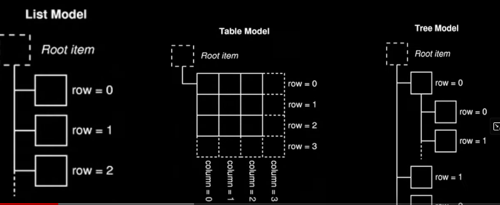

# Arquitectura Model View

Model View Controller (MVC) -> Model View (MV)

Seracion View-Controller = confusa ya que 
en Qt se acepta eventos inputs por parte del usu
via el SO y se delegan estos a los 
widgets (Controller) para manejarlos. Sin embargo,
los widgets tambien manejan la presentacion
de su propio estado para el usuario (View).

Por lo que en Qt => Model/ViewModel --> **Model/View**

## Model View

* Model actua como un 
interface entre el almacen de datos
y el ViewModel.
* View pide datos al Model y desplega
la info en el Widget.

3 Formas de representar los datos (data):

1. List Model
2. Table Model
3. Tree Model

La clase que sea Model tiene que tener **como mínimo** 2 metodos:
* `rowCount()` le permite saber a View items tiene que desplegar/mostrar.
* `data()` el metodo que utiliza View cuando hay que mostrat algo.

Otros metodos:
* `setData()` metodo que usa View para enviar datos del editor mientras estamos editando algo
* `headerData()` metodo que permite desplegar algo en el header de la tabla
* `flags()` metodo que le permite a la View saber como deberia tratar cada item. Como por ejemplo si puede ser
editable, seleccionable, habilitad...

> Tipos de roles en el libro pag 309 (ej: `Qt.DisplayRole`)

## Conpectos Python

`or` devuelve el primer
valor verdadero de una expresion
logica o el ultimo valor si todos
los valores son falsos.

En el ejemplo de `Introduccion`
donde `self.todos = todos or []`:
1. Si `todos` es una lista NO vacia
   (considerado como verdadero en el contexto
    de la evaluacion logica), entonces
`self.todos` se establecerá el valor
de `todos`. 
2. Si `todos` es una lista vacia, el booleano
`False`, o `None` (todos considerados falsos),
entonces `self.todos` se establecerá como
una **lista vacia `[]`**.

> La razón por la que funciona con tuplas 
> en este contexto específico es que las 
> tuplas, al igual que las listas, 
> son consideradas verdaderas cuando 
> contienen elementos y falsas cuando 
> están vacías. En este caso, 
> la tupla sería verdadera si tiene 
> elementos y, por lo tanto, 
> se asignaría a self.todos.

## Bibliografía
* Create GUI Applications with Python & Qt6 
| 5th edition, Martin Fitzpatrick (docu oficial)
* chatgpt
