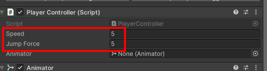
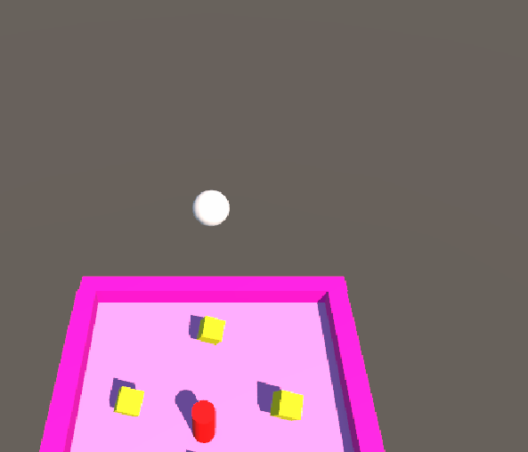
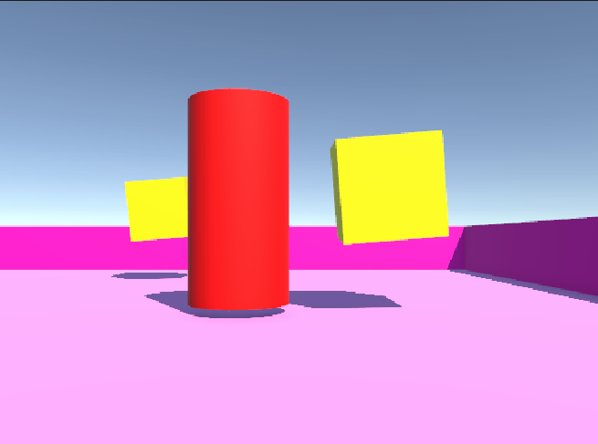
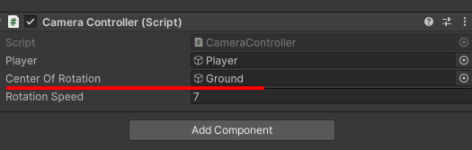

# Tarea: Unity Movimientos

Realiza el comienzo del "juego roll a ball", hasta tener el Player moviendose y la cámara siguiendolo.

Realiza modificaciones en el código para que:

1. El Player se mueva de una manera diferente, prueba a cambiar parámetros del rigibody, la fórmula de la fuerza que se aplica, etc.
2. La cámara haga un seguimiento diferente al Player, como sería en primera persona? Que otro seguimiento se te ocurre
3. La cámara se mueve independientemente del Player, ¿como sería que la cámara se moviera alrededor de la mesa?

Entrega el repositorio solo con los scripts del Player y de la Cámara

## Cámara siguiendo al Player

1. Declaramos las variables de tipo `GameObject`, perteneciente al Player, y 
de tipo `Vector3`, que corresponderá a la distancia entre el Player y la cámara.

2. En el `Start()` inicializamos la variable `Vector3 offset` la cual calcula
la distancia inicial entre el Player y la cámara.

3. Por último en el `LateUpdate()` calculamos en cada frame la posición que tendrá que tener la cámara con respecto al jugador.

```c#
public class CameraController : MonoBehaviour
{
    public GameObject player;
    private Vector3 offset;

    void Start()
    {
        offset = transform.position - player.transform.position;   
    }

    void LateUpdate()
    {
        transform.position = player.transform.position + offset;
    }
}

```

El calculo de la posición de la cámara no debe ir en el método `Update()` ya que se realizaría **antes** de que se ejecute el frame y por tanto esta transformacion podría ejecutarse antes de que se ejecute cualquier script. Esto último no es deseable ya que puede resultar en una cámara que no sigue suavemente al jugador causando inconsistencias visuales y posiblemente efectos no deseados. Por tanto, el mejor sitio para poner el codigo es en el `LateUpdate()` ya que aunque corre en cada frame como el `Update()`, va ser ejecutado **después** de que se hayan ejecutado todas las otras actualizaciones.

## Cambio fuerza y parámetros del Rigibody

Para experimentar la fuerza aplicada, cambio los valores del valor `speed` y `jumpForce` para incrementar la velocidad y la fuerza de salto de la pelota. Al haber declarado ambos valores como públicos en el script, puedo modificar los mismos desde el Inspector del Player.



Experimento en el `Rigibody` aplicándole fuerzas en direcciones
diferentes y resistencia al aire:

```c#
// Aplicar fuerza en direcciones diferentes
rb.AddForce(Vector3.forward * movementY * speed);
rb.AddForce(Vector3.right * movementX * speed);

// Agregar resistencia al aire
rb.AddForce(rb.velocity * -0.1f);
```

Elimino la gravedad en los parámetros del Rigibody:



## Cambio movimiento de cámara

Para ello introduzco a la cámara dentro del jugador y añado las siguientes lineas en el `FixedUpdate()`:

```c#
// Obtén la entrada del mouse para controlar la rotación de la cámara
float mouseX = Input.GetAxis("Mouse X");

// Rota la cámara horizontalmente según la entrada del mouse
transform.RotateAround(player.transform.position, Vector3.up, mouseX * rotationSpeed);

// Calcula la nueva posición de la cámara
Vector3 desiredPosition = player.transform.position - transform.forward;

// Establece la posición de la cámara
transform.position = desiredPosition;

// Asegura que la cámara siempre mire hacia el jugador
transform.LookAt(player.transform.position);
```

Con esto no sólo tengo a la cámara en primera persona si no que también rotará horizontalmente en función del movimiento de mi ratón.

Resultado:



Otro movimiento de la cámara que se me ocurre sería que la cámara
siguiera el movimiento del jugador pero en un plano contrapicado de forma
que se viera al jugador desde arriba, ayudando a una visión con más perspectiva del entorno.

## Cámara independiente del Player

Se ha agregado una variable `centerOfRotation` que representa el centro alrededor del cual la cámara girará.

La cámara rota alrededor del `centerOfRotation` utilizando `RotateAround()` en función del tiempo (`Time.deltaTime`). Esto hará que la rotación sea continua.

En el Inspector arrastro el `Ground` al parámetro Center Of Location (dentro del Cámera Controller) que es el objeto que hará de eje.


