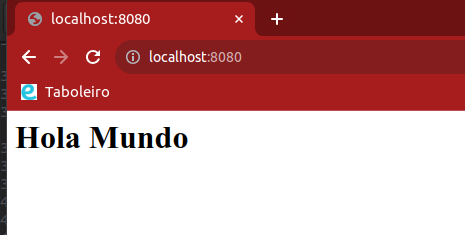
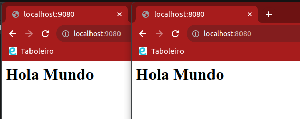
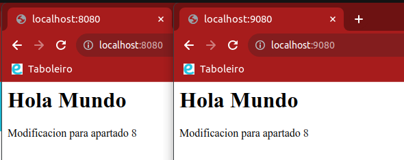

# Trabajando con volumenes
## 1. Descarga la imagen 'httpd' y comprueba que está en tu equipo.
```bash
$ docker pull http # descargo imagen de Docker Hub
$ docker image ls # listo las imagenes
```
## 2. Crea un contenedor con el nombre 'dam_httpd'.
```bash
$ docker run -dti --name dam_httpd httpd 
$ docker ps # listo contenedores levantados
```

## 3. Si quieres poder acceder desde el navegador de tu equipo, ¿que debes hacer?.

### Primero tengo que mapear los puertos

Como el direccionamiento de puertos solo puede ser especificado cuando ejecutamos el comando `docker run`, no podemos mapear el contendor ya creado. Tenemos 2 opciones:  eliminar el contenedor y crear uno nuevo (perdiendo las configuraciones hechas en el mismo hasta ahora) o podemos hacer una instantánea de
nuestro contenedor para crear una nueva imagen basada en el mismo y así no perder el progreso.

```bash
# creamos imagen basada en el contenedor "dam_httpd"
$ docker commit dam_httpd dam_httpd_image
sha256:49a19da0799201128485b3f9d7b5e5d3de812ff1e82919fd2fdca4824ab2f9d5

# lanzamos nuevo contenedor basado en la imagen anteriormente creada y mapeando los puerto
$ docker run --name dam_httpd_v2 -tdi -p 8000:80 dam_httpd_image 
0683afe191f74170875481759d1166d85da05f8456f9074451513a907130cdc5

# comprobamos que el contenedor esta mapeando los puertos
$ docker ps
CONTAINER ID   IMAGE             COMMAND              CREATED             STATUS             PORTS                                   NAMES
0683afe191f7   dam_httpd_image   "httpd-foreground"   2 minutes ago       Up 2 minutes       0.0.0.0:8000->80/tcp, :::8000->80/tcp   dam_httpd_v2
7c70cbefe8ff   httpd             "httpd-foreground"   About an hour ago   Up About an hour   80/tcp                                  dam_httpd
```

### Segundo comprobamos en el navegador del host que el servicio Apachache está levantado 

Realizamos la siguiente busqueda en el navegador web:
[http://localhost:8080/](http://localhost:8080/)

Si nos aparece el mensaje "It works" nos indica que el servicio Apache funciona correctamente.

## 4. Utiliza bind mount para que el directorio del apache2 'htdocs' este montado un directorio que tu elijas

_Un "bind mount" es una forma de montar un directorio o archivo local en un contenedor de Docker._

Como en el anterior punto, tenemos que crear un nuevo contenedor para poder montarlo. Esta vez simplemente borramos el contenedor del anterior punto y volvemos a lanzarlo añadiendo el nuevo parámetro `-v`
```bash
# tenemos que parar el contenedor para poder eliminarlo
$ docker stop dam_httpd && docker rm dam_httpd

# lanzamos el nuevo contenedor
$ docker run -tdi -p 8080:80 -v "$PWD"/htdocs:/usr/local/apache2/htdocs/ --name dam_httpd httpd
```
Lo que está a la derecha de los 2 puntos, indica la ruta del contenedor donde Apache levanta el servicio. Esta ruta no es la que queramos, es la que escoge por defecto Apache.

`$PWD` indica la ruta donde nos encontramos, por lo que previamente deberíamos posicionarnos en la carpeta donde queramos almacenar los archivos del servicio en **local**
```bash
$ pwd
/home/dam2/DAM2/SXE/docker/trabajando_con_volumenes
```
En el directorio "trabajando_con_volumenes/" tengo otro llamado "htpdocs".

> El parámetro `-v` no crea un volumen de Docker explicito, sino que monta un directorio en local en lugar de crear un volumen en Docker

## 5. Realiza un 'hola mundo' en html (usa Code) y comprueba que accedes desde el navegador.

Hacemos lo mismo que en el paso anterior pero esta vez tenemos que crear un fichero `.html` en Visual Code en la carpeta "htdocs/" al que le llamamos "index.html", ponemos la etiqueta `html`, y un titulo para visualizar en la web.

Resultado:
```bash
$ pwd
/home/ubuntu/DAM2/SXE/docker/trabajando_con_volumenes

$ cat htdocs/index.html 
<html>
    <h1>
        Hola Mundo
    </h1>
</html>
```


## 6. Crea otro contenedor 'dam_web2' con el mismo volumen y a otro puerto, por ejemplo 9080.
Como en el anterior apartado no menciona explícitamente que creemos un volumen para conservar los archivos del contenedor, 
```bash
$ pwd
/home/dam2/DAM2/SXE/docker/trabajando_con_volumenes

# lanzamos contenedor basandonos en el mismo volumen del contenedor del apartado anterior
$ docker run -tdi -p 9080:80 -v "$PWD"/htdocs:/usr/local/apache2/htdocs/ --name dam_web2 httpd
```

## 7. Comprueba que los dos servidores 'sirven' la misma página, es decir, cuando consultamos en el navegador:

```bash
$ docker ps
CONTAINER ID   IMAGE     COMMAND              CREATED         STATUS         PORTS                                   NAMES
6c941721a890   httpd     "httpd-foreground"   5 minutes ago   Up 5 minutes   0.0.0.0:9080->80/tcp, :::9080->80/tcp   dam_web2
777a78d15617   httpd     "httpd-foreground"   7 minutes ago   Up 7 minutes   0.0.0.0:8080->80/tcp, :::8080->80/tcp   dam_httpd
```

Resultado:



## 8. Realiza modificaciones de la página y comprueba que los dos servidores 'sirven' la misma página

Modificamos por ejemplo el "index.html" que tenemos en local y buscamos en el navegador introduciendo los dos sockets con la misma dirección local y los distintos puertos:


