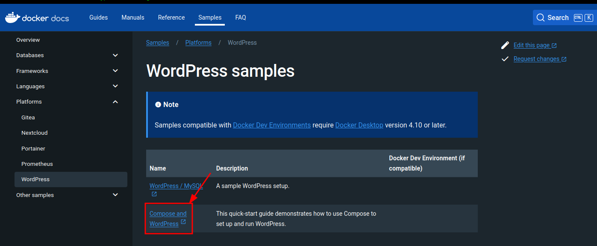
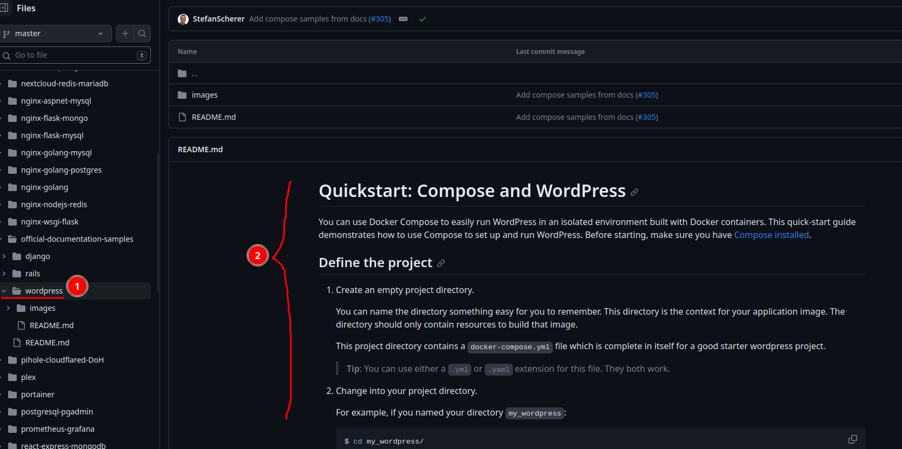

# WORDPRESS CON DOCKER
# Buscar información sobre el Compose de Docker
Ir a [Docker Hub]() y en el buscador escribir Wordpress


Nos redirige el repositorio de Git Hub de docker [Git Hub de Wordpress](https://github.com/docker/awesome-compose/tree/master/official-documentation-samples/wordpress/) donde buscaremos el directorio de Wordpress

Aquí encontraremos un _readme_ detallado donde nos explicará paso a paso como crear un Wordpress en un contenedor Docker mediante un fichero _.yml_

Como indica la guía, hay que crear un directorio en nuestra máquina host (que es dónde almacenaremos el _yml_) y posteriormente, mediante la terminal, nos ubicamos dentro.

Copiamos el código del paso 3 y lo pegamos en un fichero vacío, al que llamamos "compose.yml", dentro del repositorio que hemos creado.



El siguiente paso es configurar el docker compose:

```yml
services:
  db:
    image: mariadb:10.6.4-focal
    command: '--default-authentication-plugin=mysql_native_password'
    volumes:
      - db_data:/var/lib/mysql
    restart: always
    environment:
      - MYSQL_ROOT_PASSWORD=somewordpress
      - MYSQL_DATABASE=wordpress
      - MYSQL_USER=wordpress
      - MYSQL_PASSWORD=wordpress
    expose:
      - 3306
      - 33060
  wordpress:
    image: wordpress:latest
    volumes:
      - wp_data:/var/www/html
    ports:
      - 80:80
    restart: always
    environment:
      - WORDPRESS_DB_HOST=db
      - WORDPRESS_DB_USER=wordpress
      - WORDPRESS_DB_PASSWORD=wordpress
      - WORDPRESS_DB_NAME=wordpress
volumes:
  db_data:
  wp_data:
```
Este archivo empezará una Web de Wordpress y separá la instancia MySQL montándola en un volumen distinto.


