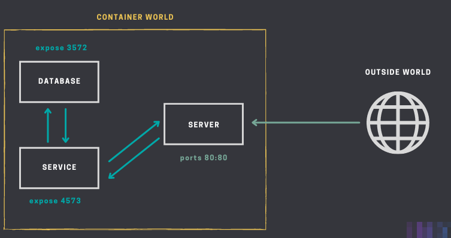
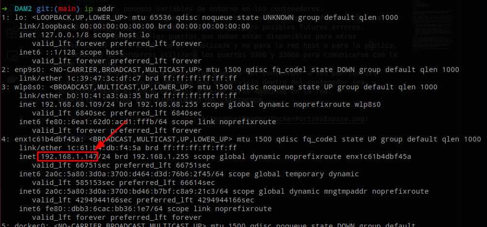
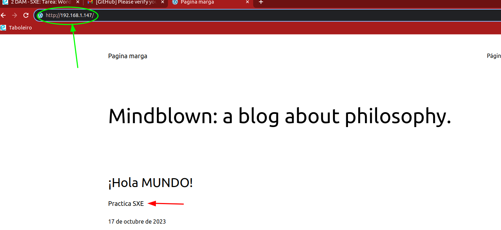

# WORDPRESS CON DOCKER
## Documentación
Ir a [Docker Docs]() y en el buscador escribir Wordpress.


Nos redirige el repositorio de  [Git Hub de Wordpress](https://github.com/docker/awesome-compose/tree/master/official-documentation-samples/wordpress/) donde buscaremos el directorio de Wordpress

Aquí encontraremos un _readme_ detallado donde nos explicará paso a paso como crear un Wordpress en un contenedor Docker mediante un fichero _.yml_


Como indica la guía, hay que crear un directorio en nuestra máquina host (dónde almacenaremos el _.yml_) y posteriormente, mediante la terminal, nos ubicamos dentro.

Copiamos el código del paso 3 y lo pegamos en un fichero vacío, al que llamamos "compose.yml", dentro del directorio que hemos creado.

## Configuración
El siguiente paso es configurar el docker compose. Este archivo lanzará dos conetenedores, uno donde se alojará la web y el otro donde se alojará la base de datos de MariaDB:

```yml
services:
  db:
    image: mariadb:10.6.4-focal
    command: '--default-authentication-plugin=mysql_native_password'
    volumes:
      - db_data:/var/lib/mysql
    #restart: always
    environment:
      - MYSQL_ROOT_PASSWORD=somewordpress
      - MYSQL_DATABASE=wordpress
      - MYSQL_USER=wordpress
      - MYSQL_PASSWORD=wordpress
    expose:
      - 3306
      - 33060
  wordpress:
    image: wordpress:latest
    volumes:
      - wp_data:/var/www/html
    ports:
      - 80:80
    #restart: always
    environment:
      - WORDPRESS_DB_HOST=db
      - WORDPRESS_DB_USER=wordpress
      - WORDPRESS_DB_PASSWORD=wordpress
      - WORDPRESS_DB_NAME=wordpress
volumes:
  db_data:
  wp_data:
```
>`restart: always` garantiza que el contenedor esté en funcionamiento continuo, y si se detiene por algún motivo, Docker Compose intentará reiniciar el contenedor inmediatamente. Por este motivo, lo comentamos para decidir nosotros cuando reiniciamos los contenedores.

* `image`: se especifica el nombre de la imagen y la etiqueta asociada (versión de la imagen) separado por 2 puntos.
* `command`: para especificar el comando que se ejecutará cuando se inicie el contenedor. En este caso, el comando se está utilizando para configurar un parámetro de la base de datos MariaDB.
* `volumes`:  especifica, separado de 2 puntos, el nombre y la ruta (en el contenedor) donde se ubica dicho volumen. Ambos volúmenes se crean la primera vez que ejecutamos el `docker compose up`.
  <details>
      <summary>¿Por qué al ejecutar en la terminal <i>docker volume ls</i> en la columna "volume name" el nombre del volumen es "wordpress_db_data" y no "db_data"? (pasa lo mismo con el de Wordpress) </summary>
      <p>
      Cuando Docker Compose crea los volúmenes puede modificar el nombre de esos volúmenes en función del proyecto y otros factores.
      Docker Compose utiliza el nombre del proyecto, que generalmente es el nombre del directorio donde se encuentra el archivo de configuración de Docker Compose, como un prefijo para los nombres de los recursos que crea, incluidos los volúmenes. Esto se hace para evitar conflictos entre proyectos y para garantizar la isolación entre ellos.
      </p>
  </details>
* `enviroment`: ponemos variables de entorno en los contenedores.
  * Si no se inicializa alguna de las variables, su valor por defecto sería una cadena vacía. Se recomienda inicializarlas para posibles futuros errores.
* `expose`: especifica los puertos que deben estar disponibles para otros contenedores en la misma red personalizada y no para la red host o para la pública. El servicio de Wordpress utilizará los puertos 3306 y 33060 para comunicarse con la base de datos.
* `ports`: se utiliza para mapear los puertos del contenedor a los puertos del sistema anfitrión, lo que permite que el servicio dentro del contenedor sea accesible desde el mundo exterior y desde otras máquinas en la red. 
PUERTO_DEL_SISTEMA_ANFITRIÓN:PUERTO_DEL_CONTENEDOR

  

## Comprobación
En la terminal ejecutamos `ip addr`:


Hacemos la siguiente búsqueda en cualquier navegador: http://192.168.1.147:80 y después de hacer la configuración inicial nos debería quedar algo parecido a esto:




