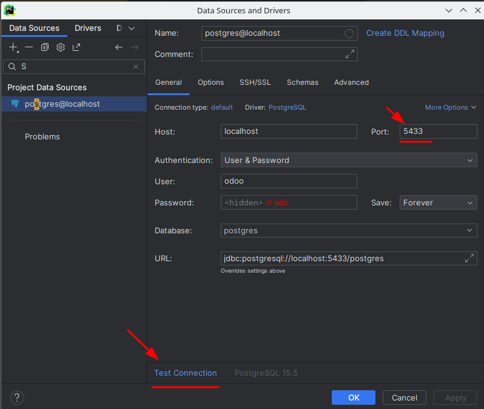

# INTRODUCCION
Configura Odoo con docker-compose
* Usar docker-compose
* Configura Postgresql y realizas pruebas
* Configura Odoo y enlazalo con el contenedor de Postgtresql
* Enlazar PyCharm con el docker y con la base de datos

Entrega el repositorio con los ficheros y en el Readme la explicación.

En el readme tiene que estar explicado las diferentes partes del docker-composer, asi como comandos para lanzar los contenedores.

¿Que ocurre si en el ordenador local el puerto 5432 está ocupado? ¿Como lo puedes solucionar?

Se valora formato del Readme, capturas, commits, funcionalidad, capturas.

## Docker compose
Busco en [docker hub](https://hub.docker.com/_/odoo) la imagen oficial de Odoo. En el apartado de
"Docker Compose examples", copio el código del primer ejemplo y lo pego en un fichero .yml dentro de mi proyecto. Este fichero corresponde a mi docker-compose.

### PostgreSQL service

#### Variables entorno

Tengo hasta 4 variables de entorno:
* `HOST` nombre del contenedor que aloja la base de datos (por defecto el nombre de la base de datos es "db").
* `PORT` puerto del **gestor de la base de datos**
* `USER`
* `PASSWORD`

En todos los **gestores de bases de datos** me tengo que conectar con un usuario y una  contraseña. Siempre que los instalo se crea un usuario por defecto ("postgres").

> No es buena practica entrar con el usuario por defecto de postgres (el usuario administrador de la base de datos), cada app deberia tener su propio usuario, en este caso `odoo`.

Mapeo los puertos ya que si no, no me puedo conectar desde mi máquina host (desde PyCharm) a mi contenedor de docker.

En mi caso, al tener el puerto 5432 ocupado, tengo que modificar el puerto al que se mapea en mi host (5433). Otra opcion seria apagar el servicio que utiliza ese puerto para poder utilizarlo con el comando `sudo service postgresql stop`.

> RECORDAR: para comprobar que tengo un puerto activo `netstat -putan`

## Conexion con PyCharm
En el menú derecho de la app añado una conexion a una base de datos SQL. En las credenciales de conexión:

## Configuracion de Odoo
En cualquier navegador busco la URL: http://localhost:8069

Checkeamos el demo data para que el Odoo no nos quede demasiado vacío.

Este instalador es para crear una base de datos. Aqui creamos una base de datos especifica para almacenar datos de Odoo
