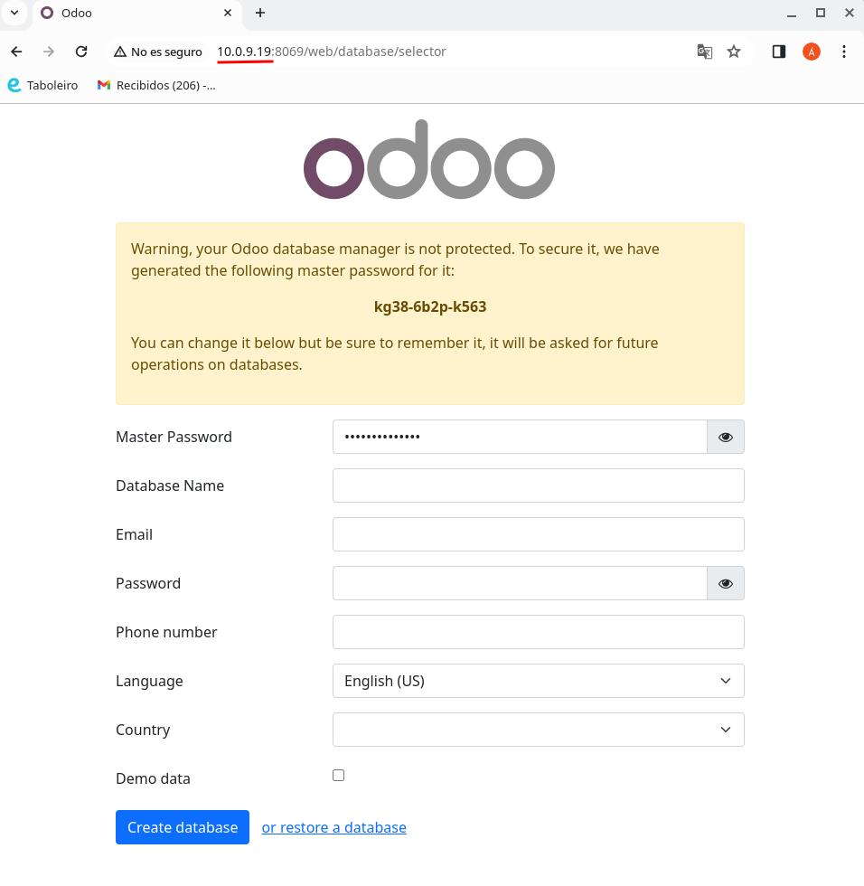

# Tarea: Odoo Instalación
Configura Odoo con docker-compose
* Usar docker-compose
* Configura Postgresql y realizas pruebas
* Configura Odoo y enlazalo con el contenedor de Postgtresql
* Enlazar PyCharm con el docker y con la base de datos

Entrega el repositorio con los ficheros y en el Readme la explicación.

En el readme tiene que estar explicado las diferentes partes del docker-composer, asi como comandos para lanzar los contenedores.

¿Que ocurre si en el ordenador local el puerto 5432 está ocupado? ¿Como lo puedes solucionar?

Se valora formato del Readme, capturas, commits, funcionalidad, capturas.

## Docker compose
Busco en [docker hub](https://hub.docker.com/_/odoo) la imagen oficial de Odoo. En el apartado de
"Docker Compose examples", copio el código del primer ejemplo y lo pego en un fichero .yml dentro de mi proyecto. Este fichero corresponde a mi docker-compose.

### Servicio de PostgreSQL

Tengo hasta 4 variables de entorno:
* `HOST` nombre del contenedor que aloja la base de datos. Por defecto el nombre de la base de datos es "db".
Por lo tanto, si en el docker-compose no añadimos esta variable (`HOST`) y posteriomente
la modificamos (por ejemplo: `HOST=mydb`), odoo, por defecto,
va a buscar la base de datos como "db".
* `PORT` puerto del **gestor de la base de datos**.
* `USER`
* `PASSWORD`

Ejemplo: _cambiar nombre de la base de datos a la que se conecta Odoo._

1. Añado variable de entorno
dentro del compose en la parte del servicio web de Odoo: `HOST=mydb`.
2. Modifico el nombre del servicio de la base de datos. Por defecto 
denominado como `db`. Se lo tenemos que cambair a `mydb`.

En todos los **gestores de bases de datos** me tengo que conectar con un usuario y una  contraseña. Siempre que los instalo se crea un usuario por defecto ("postgres").

> No es buena practica entrar con el usuario por defecto de postgres (el usuario administrador de la base de datos)
> para administrar la base de datos, 
> cada app deberia tener su propio usuario, en este caso "odoo".

----

Tengo que mapear los puertos ya que si no, no me puedo conectar desde mi máquina host (desde PyCharm) a mi contenedor de docker.

Además, en mi caso, al tener el puerto 5432 ocupado, tengo que modificar el puerto al que se mapea en mi host (nuevo puerto
elegido: 5433). Otra opción seria apagar el servicio que utiliza ese puerto para poder utilizarlo en Odoo.
Con el comando `sudo service postgresql stop` cancelo el servicio actual que está utilizando el puerto.

> Para comprobar que tengo un puerto activo `netstat -putan`

## Levantamiento servicios
Para levantar el docker-compose, me posisiono en la ubicación del
fichero *.iml* desde la terminal y ejecuto `docker compose up -d`.

Compruebo que tengo los servicios levantandos (tanto el de la base de datos
como el de la web) con `docker ps`. Si no están levantados ejecuto 
`docker ps -a` para comprobar como se llaman los contenedores donde
tengo alojados los servicios y con `docker start [NOMBRE_CONTENEDOR]`
levanto el contenedor.

## Conexión con PyCharm
En el menú derecho de la app añado una conexion a una base de datos SQL. En las credenciales de conexión:


## Configuracion de Odoo
Averiguo la IP de mi ordenador con `ip addr`.

En cualquier navegador busco la URL: http://DIRECCION_IP:8069

En mi caso la "DIRECCION_IP" es 10.0.9.19 (localhost).

Checkeamos el demo data para que el Odoo no nos quede demasiado vacío.

En este instalador hay que crear una nueva base de datos, la cual utilizará
Odoo. La anterior base de datos y las variables de entorno que definimos anteriormente
son solo para que Odoo pueda conectarse a esa base de datos con las
credenciales de "superuser" y así poder crear una base de datos concreta para todo lo
relacionado con Odoo.




# Creacion modulo

## Primeros pasos
1. Creo una copia de _tareaOdoo_ y me abro el proyecto de la copia en 
PyCharm.
2. Defino los volumenes en el compose
3. Creo una carpeta llamada _extra-addons_
dentro de _tareaOdoo_copia_,
4. Ejecuto los siguiente comandos por consola

```bash
# fuera del contendor
$ docker exec -u root -it tareaodoo_copia-web-1 /bin/bash

# dentro del contedor
$ cd /mnt/extra-addons/
$ odoo scaffold openacademy
$ chmod -R 777 openacademy
$ exit
```

## Odoo en navegador
Ahora ya me puedo meter en el Odoo por el navegador y relleno
nuevos credenciales:

* Master pswd: admin
* ce: acastineiraduran@danielcastelao.org
* Database name: odoo_copia
* pswd: 1234

### Modulo

1. Me dirijo al apartado de Aplicaciones.
2. En el buscador escribo "open" y le damos al enter.
3. Nos aparece el módulo "openacademy" el cual vamos a guardar en favoritos
para que nos sea más facil encontrarlo y le damos a "ACTIVAR".

## Cambios codigo

En el `__manifest__.py` cambio el resumen, autor...

Para ver los nuevos cambios: 3 puntitos en el modulo, más info.


