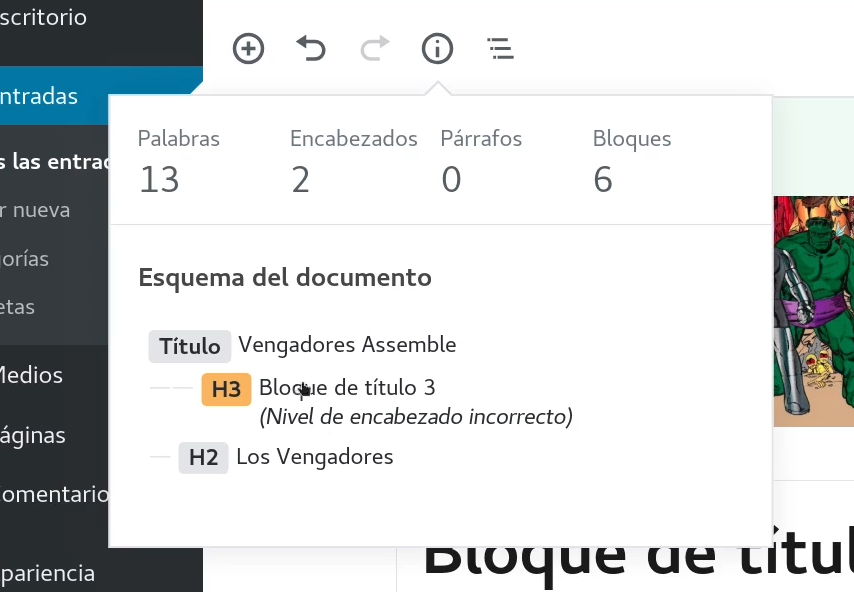

# Posibles errores
* Error al subir una imagen en una entrada: 

_unable to create directory wp-contents/uploads/2023/12_
Cambiar permisos (solucion que funciona pero no confirmada)
`sudo chmod 755 [directory]`

* De sintaxis, introducir h2 antes que h3, ya me lo indica en naranja



* No me deja instalar plugins en wordpres _Installation failed: Could not create directory_

Probé a cambiar los permisos y nada, probe a añadir las siguientes lineas en el wp-config-php:

```php
define('FS_METHOD', 'direct');
```

Lo qu hay que hacer es cambiar los permisos del directorio
`wp-content` en 777 y luego añadir la linea anterior. De esa
forma me funcionó pero no es la recomendada.


